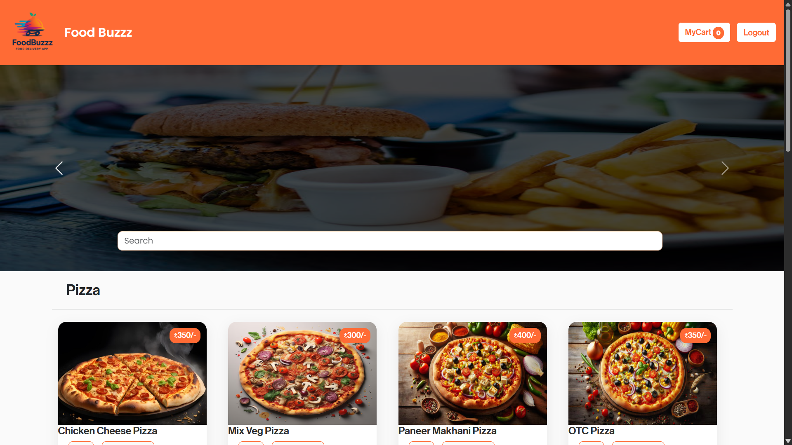
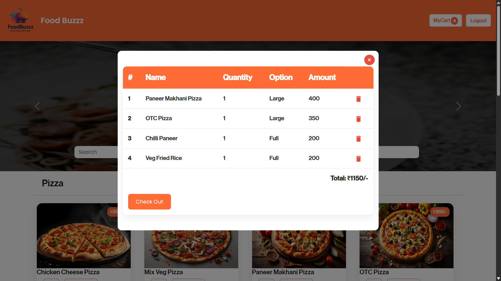

# 🍔 Food Buzzz – Online Food Ordering App  

     

**Food Buzzz** is a full-stack **MERN (MongoDB, Express, React, Node.js)** web app designed to deliver a smooth online food ordering experience.  
It features **real-time cart management, order tracking, authentication, and order history** for users — all in a **beautiful, modern UI**.

---

## ✨ Features

### 🛍️ **For Users**
- **Browse food categories & items** (dynamic menu from MongoDB).
- **Add to Cart & Customize Quantities/Sizes** in real-time.
- **User Authentication (Login/Register)** using JWT.
- **Order Checkout & Storage** (MongoDB backend).
- **View Past Orders** (with **dates and order breakdown**).
- Fully responsive for **desktop, tablet, and mobile**.

### ⚙️ **For Developers**
- **Clean, modular MERN stack** architecture.
- **REST API** for authentication, orders, and menu.
- **Protected routes** for sensitive endpoints.
- **Context API & Reducer** for global state management.
- Easy to **extend & deploy** (Heroku, Vercel, or AWS).

---

## 🖼️ Screenshots

### Home Page  


### Cart System  


---

## 🛠️ Tech Stack

**Frontend:**  
- React (Hooks + Context API)  
- Bootstrap 5 + Custom CSS  
- Material UI Icons  

**Backend:**  
- Node.js  
- Express.js  
- MongoDB (Mongoose ODM)  

**Authentication:**  
- JSON Web Tokens (JWT)  
- bcrypt for password hashing  

**State Management:**  
- Context API + useReducer  

---

## 🚀 Getting Started  

### 1️⃣ Clone the repo  
```bash
git clone https://github.com/<your-username>/<repo-name>.git
cd <repo-name>
```
### 2️⃣ Setup Backend
```bash
cd backend
npm install
# Add your MongoDB URI in .env
npm start
```
### 3️⃣ Setup Frontend
```bash
cd ../frontend
npm install
npm start
Open http://localhost:3000 in your browser.
```
### 🔥 Why You’ll Love It
Fully functional: Works like a real food delivery app (cart, checkout, orders).

Production-ready codebase: Easy to deploy & customize.

Modern UI & UX: Clean, responsive, and interactive.

Beginner-Friendly: Well-structured, easy to understand & extend.

### 🤝 Contributing
Pull requests are welcome! For major changes, please open an issue first
to discuss what you’d like to change.

### 📜 License
This project is licensed under the MIT License.

### ⭐ Show Your Support
If you like this project, give it a ⭐ on GitHub — it keeps me motivated!